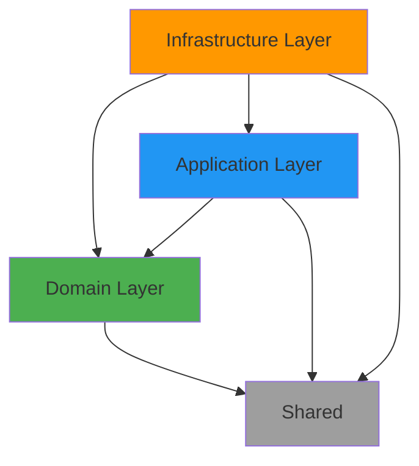

# Guardian Roadmap 🗺️

**Last Updated:** 2025-01-24
**Current Version:** 0.5.1

This document outlines the current features and strategic roadmap for @puaros/guardian, prioritized based on market competition analysis and enterprise adoption requirements.

---

## 📊 Current State (v0.5.1) ✅

### ✨ Unique Competitive Advantages

Guardian currently has **5 unique features** that competitors don't offer:

| Feature | Status | Competitors |
|---------|--------|-------------|
| **Hardcode Detection + AI Suggestions** | ✅ Released | ❌ None |
| **Framework Leak Detection** | ✅ Released | ❌ None |
| **Entity Exposure Detection** | ✅ Released (v0.3.0) | ❌ None |
| **Dependency Direction Enforcement** | ✅ Released (v0.4.0) | ⚠️ dependency-cruiser (via rules) |
| **Repository Pattern Validation** | ✅ Released (v0.5.0) | ❌ None |

### 🛠️ Core Features (v0.1.0-v0.5.0)

**Detection Capabilities:**
- ✅ Hardcode detection (magic numbers, magic strings) with smart suggestions
- ✅ Circular dependency detection
- ✅ Naming convention enforcement (DDD layer-based rules)
- ✅ Clean Architecture layer violations
- ✅ Framework leak detection (domain importing frameworks)
- ✅ Entity exposure in API responses (v0.3.0)
- ✅ Dependency direction validation (v0.4.0)
- ✅ Repository pattern validation (v0.5.0)

**Developer Experience:**
- ✅ CLI interface with `guardian check` command
- ✅ Smart constant name suggestions
- ✅ Layer distribution analysis
- ✅ Detailed violation reports with file:line:column
- ✅ Context snippets for each issue

**Quality & Testing:**
- ✅ 194 tests across 7 test files (all passing)
- ✅ 80%+ code coverage on all metrics
- ✅ Self-analysis: 0 violations (100% clean codebase)

---

## 🎯 Strategic Roadmap Overview

### Phase 1: Market Parity (v0.6-v0.10) - Q1-Q2 2026
**Goal:** Match competitors' baseline features to enable enterprise adoption

- Configuration & Presets
- Visualization & Dependency Graphs
- CI/CD Integration Kit
- Auto-Fix & Code Generation (UNIQUE!)
- Metrics & Quality Score

### Phase 2: DDD Specialization (v0.11-v0.27) - Q3-Q4 2026
**Goal:** Deepen DDD/Clean Architecture expertise

- Advanced DDD pattern detection (25+ features)
- Aggregate boundaries, Domain Events, Value Objects
- CQRS, Saga Pattern, Anti-Corruption Layer
- Ubiquitous Language validation

### Phase 3: Enterprise Ecosystem (v1.0+) - Q4 2026+
**Goal:** Full-featured enterprise platform

- VS Code extension
- JetBrains plugin
- Web dashboard
- Team analytics
- Multi-language support

---

## 📅 Detailed Roadmap

## Version 0.6.0 - Configuration & Presets ⚙️
**Target:** Q1 2026 (January-February)
**Priority:** 🔥 CRITICAL

> **Why Critical:** All competitors (SonarQube, ESLint, dependency-cruiser) have configuration. Without this, Guardian cannot be customized for different teams/projects.

### Features

#### 1. Configuration File Support

```javascript
// guardian.config.js (primary)
export default {
    // Zero-config presets
    preset: 'clean-architecture',  // or 'ddd', 'hexagonal', 'onion'

    // Rule configuration
    rules: {
        'hardcode/magic-numbers': 'error',
        'hardcode/magic-strings': 'warn',
        'architecture/layer-violation': 'error',
        'architecture/framework-leak': 'error',
        'architecture/entity-exposure': 'error',
        'circular-dependency': 'error',
        'naming-convention': 'warn',
        'dependency-direction': 'error',
        'repository-pattern': 'error',
    },

    // Custom layer paths
    layers: {
        domain: 'src/core/domain',
        application: 'src/core/application',
        infrastructure: 'src/adapters',
        shared: 'src/shared',
    },

    // Exclusions
    exclude: [
        '**/*.test.ts',
        '**/*.spec.ts',
        'scripts/',
        'migrations/',
        'node_modules/',
    ],

    // Per-rule ignores
    ignore: {
        'hardcode/magic-numbers': {
            'src/config/constants.ts': [3000, 8080],
        },
    },
}
```

#### 2. Built-in Presets

```javascript
// Preset: clean-architecture (default)
preset: 'clean-architecture'
// Enables: layer-violation, dependency-direction, naming-convention

// Preset: ddd
preset: 'ddd'
// Enables all DDD patterns: aggregates, value-objects, domain-events

// Preset: hexagonal (Ports & Adapters)
preset: 'hexagonal'
// Validates port/adapter separation

// Preset: minimal (for prototyping)
preset: 'minimal'
// Only critical rules: hardcode, circular-deps
```

#### 3. Framework-Specific Presets

```javascript
// NestJS
preset: 'nestjs-clean-architecture'

// Express
preset: 'express-clean-architecture'

// Next.js
preset: 'nextjs-clean-architecture'
```

#### 4. Configuration Discovery

Support multiple config file formats:
- `guardian.config.js` (ES modules)
- `guardian.config.cjs` (CommonJS)
- `.guardianrc` (JSON)
- `.guardianrc.json`
- `package.json` (`guardian` field)

#### 5. CLI Override

```bash
# Override config from CLI
guardian check ./src --rule hardcode/magic-numbers=off

# Use specific config file
guardian check ./src --config custom-config.js

# Generate config
guardian init --preset clean-architecture
```

### Implementation Tasks
- [ ] Create config parser and validator
- [ ] Implement preset system
- [ ] Add config discovery logic
- [ ] Update AnalyzeProject use case to accept config
- [ ] CLI integration for config override
- [ ] Add `guardian init` command
- [ ] Documentation and examples
- [ ] Tests (config parsing, presets, overrides)

---

## Version 0.7.0 - Visualization & Dependency Graphs 🎨
**Target:** Q1 2026 (March)
**Priority:** 🔥 HIGH

> **Why High:** dependency-cruiser's main advantage is visualization. Guardian needs this to compete.

### Features

#### 1. Dependency Graph Visualization

```bash
# Generate SVG graph
guardian visualize ./src --output architecture.svg

# Interactive HTML
guardian visualize ./src --format html --output report.html

# Mermaid diagram for docs
guardian graph ./src --format mermaid > ARCHITECTURE.md

# ASCII tree for terminal
guardian visualize ./src --format ascii
```

#### 2. Layer Dependency Diagram



#### 3. Violation Highlighting

Visualize violations on graph:
- 🔴 Circular dependencies (red arrows)
- ⚠️ Framework leaks (yellow highlights)
- 🚫 Wrong dependency direction (dashed red arrows)
- ✅ Correct dependencies (green arrows)

#### 4. Metrics Overlay

```bash
guardian visualize ./src --show-metrics

# Shows on each node:
# - File count per layer
# - Hardcode violations count
# - Complexity score
```

#### 5. Export Formats

- SVG (for docs/website)
- PNG (for presentations)
- HTML (interactive, zoomable)
- Mermaid (for markdown docs)
- DOT (Graphviz format)
- JSON (for custom processing)

### Implementation Tasks
- [ ] Implement graph generation engine
- [ ] Add SVG/PNG renderer
- [ ] Create Mermaid diagram generator
- [ ] Build HTML interactive viewer
- [ ] Add violation highlighting
- [ ] Metrics overlay system
- [ ] CLI commands (`visualize`, `graph`)
- [ ] Documentation and examples
- [ ] Tests (graph generation, formats)

---

## Version 0.8.0 - CI/CD Integration Kit 🚀
**Target:** Q2 2026 (April)
**Priority:** 🔥 HIGH

> **Why High:** Enterprise requires CI/CD integration. SonarQube succeeds because of this.

### Features

#### 1. GitHub Actions

```yaml
# .github/workflows/guardian.yml (ready-to-use template)
name: Guardian Quality Check

on: [push, pull_request]

jobs:
  guardian:
    runs-on: ubuntu-latest
    steps:
      - uses: actions/checkout@v3
      - uses: actions/setup-node@v3

      - name: Guardian Analysis
        uses: puaros/guardian-action@v1
        with:
          path: './src'
          fail-on: 'error'
          report-format: 'markdown'

      - name: Comment PR
        uses: actions/github-script@v6
        if: github.event_name == 'pull_request'
        with:
          script: |
            // Auto-comment violations on PR
```

#### 2. GitLab CI Template

```yaml
# .gitlab-ci.yml
include:
  - template: Guardian.gitlab-ci.yml

guardian_check:
  stage: test
  extends: .guardian
  variables:
    GUARDIAN_FAIL_ON: "error"
    GUARDIAN_FORMAT: "markdown"
```

#### 3. Quality Gate

```bash
# Fail build on violations
guardian check ./src --fail-on error
guardian check ./src --fail-on warning

# Threshold-based
guardian check ./src --max-violations 10
guardian check ./src --max-hardcode 5
```

#### 4. PR Auto-Comments

Automatically comment on PRs with:
- Summary of violations
- Comparison with base branch
- Quality score change
- Actionable suggestions

```markdown
## 🛡️ Guardian Report

**Quality Score:** 87/100 (⬆️ +3 from main)

### Violations Found: 5

#### 🔴 Critical (2)
- `src/api/server.ts:15` - Hardcoded port 3000
- `src/domain/User.ts:10` - Framework leak (Express)

#### ⚠️ Warnings (3)
- `src/services/UserService.ts` - Naming convention
- ...

[View Full Report](link)
```

#### 5. Pre-commit Hook

```bash
# Install via npx
npx guardian install-hooks

# Creates .husky/pre-commit
#!/bin/sh
guardian check --staged --fail-on error
```

#### 6. Status Checks

Integrate with GitHub/GitLab status checks:
- ✅ No violations
- ⚠️ Warnings only
- ❌ Errors found

### Implementation Tasks
- [ ] Create GitHub Action
- [ ] Create GitLab CI template
- [ ] Implement quality gate logic
- [ ] Build PR comment generator
- [ ] Pre-commit hook installer
- [ ] Status check integration
- [ ] Bitbucket Pipelines support
- [ ] Documentation and examples
- [ ] Tests (CI/CD scenarios)

---

## Version 0.9.0 - Auto-Fix & Code Generation 🤖
**Target:** Q2 2026 (May)
**Priority:** 🚀 GAME-CHANGER (UNIQUE!)

> **Why Game-Changer:** No competitor has intelligent auto-fix for architecture. This makes Guardian unique!

### Features

#### 1. Auto-Fix Hardcode

```bash
# Fix all hardcode violations automatically
guardian fix ./src --auto

# Preview changes
guardian fix ./src --dry-run

# Fix specific types
guardian fix ./src --type hardcode
guardian fix ./src --type naming
```

**Example:**

```typescript
// Before
const timeout = 5000
app.listen(3000)

// After (auto-generated constants.ts)
export const DEFAULT_TIMEOUT_MS = 5000
export const DEFAULT_PORT = 3000

// After (fixed code)
import { DEFAULT_TIMEOUT_MS, DEFAULT_PORT } from './constants'
const timeout = DEFAULT_TIMEOUT_MS
app.listen(DEFAULT_PORT)
```

#### 2. Generate Constants File

```bash
# Extract all hardcodes to constants
guardian generate constants ./src --output src/config/constants.ts

# Generated file:
// src/config/constants.ts
export const DEFAULT_TIMEOUT_MS = 5000
export const DEFAULT_PORT = 3000
export const MAX_RETRIES = 3
export const API_BASE_URL = 'http://localhost:8080'
```

#### 3. Fix Naming Violations

```bash
# Rename files to match conventions
guardian fix naming ./src --auto

# Before: src/application/use-cases/user.ts
# After:  src/application/use-cases/CreateUser.ts
```

#### 4. AI-Friendly Fix Prompts

```bash
# Generate prompt for AI assistant
guardian check ./src --format ai-prompt > fix-prompt.txt

# Output (optimized for Claude/GPT):
"""
Fix the following Guardian violations:

1. HARDCODE (src/api/server.ts:15)
   - Replace: app.listen(3000)
   - With: Extract 3000 to DEFAULT_PORT constant
   - Location: Create src/config/constants.ts

2. FRAMEWORK_LEAK (src/domain/User.ts:5)
   - Remove: import { Request } from 'express'
   - Reason: Domain layer cannot import frameworks
   - Suggestion: Use dependency injection via interfaces

[Complete fix suggestions...]
"""

# Then feed to Claude:
# cat fix-prompt.txt | pbcopy
# Paste into Claude: "Fix these Guardian violations"
```

#### 5. Interactive Fix Mode

```bash
# Interactive fix selection
guardian fix ./src --interactive

# Prompts:
# ? Fix hardcode in server.ts:15 (3000)? (Y/n)
# ? Suggested constant name: DEFAULT_PORT
#   [Edit name] [Skip] [Fix All]
```

#### 6. Refactoring Commands

```bash
# Break circular dependency
guardian refactor circular ./src/services/UserService.ts
# Suggests: Extract shared interface

# Fix layer violation
guardian refactor layer ./src/domain/entities/User.ts
# Suggests: Move framework imports to infrastructure
```

### Implementation Tasks
- [ ] Implement auto-fix engine (AST transformation)
- [ ] Constants extractor and generator
- [ ] File renaming system
- [ ] AI prompt generator
- [ ] Interactive fix mode
- [ ] Refactoring suggestions
- [ ] Safe rollback mechanism
- [ ] Documentation and examples
- [ ] Tests (fix scenarios, edge cases)

---

## Version 0.10.0 - Metrics & Quality Score 📊
**Target:** Q2 2026 (June)
**Priority:** 🔥 HIGH

> **Why High:** Enterprise needs metrics to justify investment. SonarQube's dashboard is a major selling point.

### Features

#### 1. Quality Score (0-100)

```bash
guardian score ./src

# Output:
# 🛡️ Guardian Quality Score: 87/100 (Good)
#
# Category Breakdown:
# ✅ Architecture:     95/100 (Excellent)
# ⚠️ Hardcode:         78/100 (Needs Improvement)
# ✅ Naming:           92/100 (Excellent)
# ✅ Dependencies:     89/100 (Good)
```

**Score Calculation:**
- Architecture violations: -5 per error
- Hardcode violations: -1 per occurrence
- Circular dependencies: -10 per cycle
- Naming violations: -2 per error

#### 2. Metrics Dashboard (JSON/HTML)

```bash
# Export metrics
guardian metrics ./src --format json > metrics.json
guardian metrics ./src --format html > dashboard.html

# Metrics included:
{
  "qualityScore": 87,
  "violations": {
    "hardcode": 12,
    "circular": 0,
    "architecture": 2,
    "naming": 5
  },
  "metrics": {
    "totalFiles": 45,
    "totalLOC": 3500,
    "hardcodePerKLOC": 3.4,
    "averageFilesPerLayer": 11.25
  },
  "trends": {
    "scoreChange": "+5",
    "violationsChange": "-8"
  }
}
```

#### 3. Trend Analysis

```bash
# Compare with main branch
guardian metrics ./src --compare-with main

# Output:
# Quality Score: 87/100 (⬆️ +3 from main)
#
# Changes:
# ✅ Hardcode violations: 12 (⬇️ -5)
# ⚠️ Naming violations: 5 (⬆️ +2)
# ✅ Circular deps: 0 (⬇️ -1)
```

#### 4. Historical Tracking

```bash
# Store metrics history
guardian metrics ./src --save

# View trends
guardian trends --last 30d

# Output: ASCII graph showing quality score over time
```

#### 5. Export for Dashboards

```bash
# Prometheus format
guardian metrics ./src --format prometheus

# Grafana JSON
guardian metrics ./src --format grafana

# CSV for Excel
guardian metrics ./src --format csv
```

#### 6. Badge Generation

```bash
# Generate badge for README
guardian badge ./src --output badge.svg

# Markdown badge

```

### Implementation Tasks
- [ ] Quality score calculation algorithm
- [ ] Metrics collection system
- [ ] Trend analysis engine
- [ ] JSON/HTML/Prometheus exporters
- [ ] Historical data storage
- [ ] Badge generator
- [ ] CLI commands (`score`, `metrics`, `trends`, `badge`)
- [ ] Documentation and examples
- [ ] Tests (metrics calculation, exports)

---

## Version 0.11.0+ - DDD Specialization 🏗️
**Target:** Q3-Q4 2026
**Priority:** MEDIUM (After Market Parity)

Now we can focus on Guardian's unique DDD/Clean Architecture specialization:

### v0.11.0 - Aggregate Boundary Validation 🔒
- Detect entity references across aggregates
- Enforce ID-only references between aggregates
- Validate aggregate root access patterns

### v0.12.0 - Anemic Domain Model Detection 🩺
- Detect entities with only getters/setters
- Count methods vs properties ratio
- Suggest moving logic from services to entities

### v0.13.0 - Domain Event Validation 📢
- Validate event publishing pattern
- Check events inherit from DomainEvent base
- Detect direct infrastructure calls from entities

### v0.14.0 - Value Object Immutability 🔐
- Ensure Value Objects have readonly fields
- Detect public setters
- Verify equals() method exists

### v0.15.0 - Use Case Single Responsibility 🎯
- Check Use Case has single public method (execute)
- Detect multiple responsibilities
- Suggest splitting large Use Cases

### v0.16.0 - Interface Segregation 🔌
- Count methods per interface (> 10 = warning)
- Check method cohesion
- Suggest interface splitting

### v0.17.0 - Port-Adapter Pattern 🔌
- Check Ports (interfaces) are in application/domain
- Verify Adapters are in infrastructure
- Detect external library imports in use cases

### v0.18.0 - Command Query Separation (CQRS) 📝
- Detect methods that both change state and return data
- Check Use Case names for CQS violations
- Validate Command Use Cases return void

### v0.19.0 - Factory Pattern Validation 🏭
- Detect complex logic in entity constructors
- Check for `new Entity()` calls in use cases
- Suggest extracting construction to Factory

### v0.20.0 - Specification Pattern Detection 🔍
- Detect complex business rules in use cases
- Validate Specification classes in domain
- Suggest extracting rules to Specifications

### v0.21.0 - Layered Service Anti-pattern ⚠️
- Detect service methods operating on single entity
- Validate entities have behavior methods
- Suggest moving service methods to entities

### v0.22.0 - Bounded Context Leak Detection 🚧
- Detect entity imports across contexts
- Validate only ID references between contexts
- Verify event-based integration

### v0.23.0 - Transaction Script Detection 📜
- Detect procedural logic in use cases
- Check use case length (> 30-50 lines = warning)
- Suggest moving logic to domain entities

### v0.24.0 - Persistence Ignorance 💾
- Detect ORM decorators in domain entities
- Check for ORM library imports in domain
- Suggest persistence ignorance pattern

### v0.25.0 - Null Object Pattern Detection 🎭
- Count null checks in use cases
- Suggest Null Object pattern
- Detect repositories returning null vs Null Object

### v0.26.0 - Primitive Obsession Detection 🔢
- Detect methods with > 3 primitive parameters
- Check for common Value Object candidates
- Suggest creating Value Objects

### v0.27.0 - Service Locator Anti-pattern 🔍
- Detect global ServiceLocator/Registry classes
- Validate constructor injection
- Suggest DI container usage

### v0.28.0 - Double Dispatch Pattern 🎯
- Detect frequent instanceof or type checking
- Check for long if-else/switch by type
- Suggest Visitor pattern

### v0.29.0 - Entity Identity Validation 🆔
- Detect public mutable ID fields
- Validate ID is Value Object
- Check for equals() method implementation

### v0.30.0 - Saga Pattern Detection 🔄
- Detect multiple external calls without compensation
- Validate compensating transactions
- Suggest Saga pattern for distributed operations

### v0.31.0 - Anti-Corruption Layer Detection 🛡️
- Detect direct legacy library imports
- Check for domain adaptation to external APIs
- Validate translator/adapter layer exists

### v0.32.0 - Ubiquitous Language Validation 📖
**Priority: HIGH**
- Detect synonyms for same concepts (User/Customer/Client)
- Check inconsistent verbs (Create/Register/SignUp)
- Require Ubiquitous Language glossary

---

## Version 1.0.0 - Stable Release 🚀
**Target:** Q4 2026 (December)
**Priority:** 🔥 CRITICAL

Production-ready stable release with ecosystem:

### Core Features
- ✅ All detection features stabilized
- ✅ Configuration & presets
- ✅ Visualization & graphs
- ✅ CI/CD integration
- ✅ Auto-fix & code generation
- ✅ Metrics & quality score
- ✅ 30+ DDD pattern detectors

### Ecosystem

#### VS Code Extension
- Real-time detection as you type
- Inline suggestions and quick fixes
- Problem panel integration
- Code actions for auto-fix

#### JetBrains Plugin
- IntelliJ IDEA, WebStorm support
- Inspection integration
- Quick fixes

#### Web Dashboard
- Team quality metrics
- Historical trends
- Per-developer analytics
- Project comparison

#### GitHub Integration
- GitHub App
- Code scanning integration
- Dependency insights
- Security alerts for architecture violations

---

## 💡 Future Ideas (Post-1.0.0)

### Multi-Language Support
- Python (Django/Flask + DDD)
- C# (.NET + Clean Architecture)
- Java (Spring Boot + DDD)
- Go (Clean Architecture)

### AI-Powered Features
- LLM-based fix suggestions
- AI generates code for complex refactorings
- Claude/GPT API integration
- Natural language architecture queries

### Team Analytics
- Per-developer quality metrics
- Team quality trends dashboard
- Technical debt tracking
- Leaderboards (gamification)

### Security Features
- Secrets detection (API keys, passwords)
- SQL injection pattern detection
- XSS vulnerability patterns
- Dependency vulnerability scanning

### Code Quality Metrics
- Maintainability index
- Technical debt estimation
- Code duplication detection
- Complexity trends

---

## 🎯 Success Criteria

### v0.10.0 (Market Parity Achieved)
- ✅ Configuration support (compete with ESLint)
- ✅ Visualization (compete with dependency-cruiser)
- ✅ CI/CD integration (compete with SonarQube)
- ✅ Auto-fix (UNIQUE! Game-changer)
- ✅ Metrics dashboard (compete with SonarQube)

### v1.0.0 (Enterprise Ready)
- ✅ 1000+ GitHub stars
- ✅ 100+ npm installs/week
- ✅ 10+ enterprise adopters
- ✅ 99%+ test coverage
- ✅ Complete documentation
- ✅ IDE extensions available

---

## 📊 Competitive Positioning

| Feature | Guardian v1.0 | SonarQube | dependency-cruiser | ArchUnit | FTA |
|---------|---------------|-----------|-------------------|----------|-----|
| TypeScript Focus | ✅✅ | ⚠️ | ✅✅ | ❌ | ✅✅ |
| Hardcode + AI Tips | ✅✅ UNIQUE | ⚠️ | ❌ | ❌ | ❌ |
| Architecture (DDD) | ✅✅ UNIQUE | ⚠️ | ⚠️ | ✅ | ❌ |
| Visualization | ✅ | ✅ | ✅✅ | ❌ | ⚠️ |
| Auto-Fix | ✅✅ UNIQUE | ❌ | ❌ | ❌ | ❌ |
| Configuration | ✅ | ✅✅ | ✅ | ✅ | ⚠️ |
| CI/CD | ✅ | ✅✅ | ✅ | ✅ | ⚠️ |
| Metrics | ✅ | ✅✅ | ⚠️ | ❌ | ✅✅ |
| Security (SAST) | ❌ | ✅✅ | ❌ | ❌ | ❌ |
| Multi-language | ❌ | ✅✅ | ⚠️ | ⚠️ | ❌ |

**Guardian's Position:** The AI-First Architecture Guardian for TypeScript/DDD teams

---

## 🤝 Contributing

Want to help build Guardian? Check out:
- [GitHub Issues](https://github.com/samiyev/puaros/issues)
- [CONTRIBUTING.md](../../CONTRIBUTING.md)
- [Discord Community](#) (coming soon)

---

## 📈 Versioning

Guardian follows [Semantic Versioning](https://semver.org/):
- **MAJOR** (1.0.0) - Breaking changes
- **MINOR** (0.x.0) - New features, backwards compatible
- **PATCH** (0.x.y) - Bug fixes

Until 1.0.0, minor versions may include breaking changes as we iterate on the API.